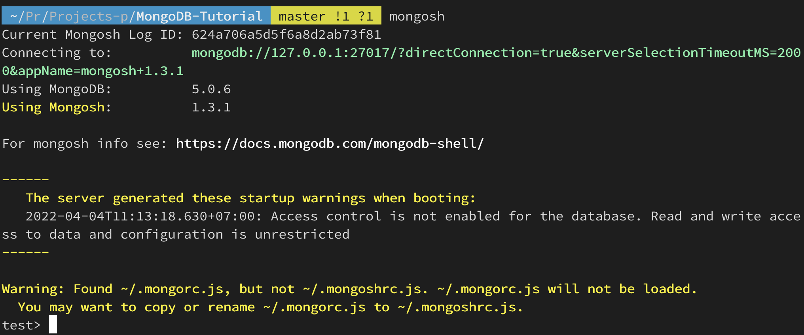
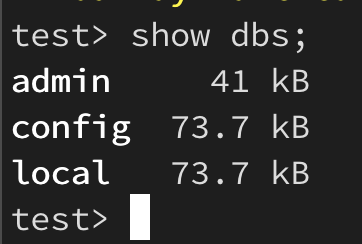

# MongoDB-Tutorial
My own tutorial for self-learning.

## Setup requirements
### 1.Macos (M1)
#### Prerequirements
+ Install [HomeBrew](https://brew.sh).
+ Install [Xcode](https://developer.apple.com/xcode/).

#### Install MongoDB
```bash
brew tap mongodb/brew
brew install mongodb-community@5.0
```

#### Check version MongoDB
```bash
mongo --version
```
*Expected Output:* MongoDB shell version v5.0.6 (depend on your version).

#### Install MongoDB Shell (optional)
*MongoDB Shell* (mongosh) to test queries and operations directly with your database.
```bash
brew install mongosh
```
#### Check version MongoDB Shell
```bash
mongosh --version
```
*Expected Output:* 1.3.1 (depend on your version).

#### Start MongoDB
To run MongoDB (i.e. the mongod process) as a macOS service:
```bash
brew services start mongodb-community@5.0
```
*Expected Output:* ==> Successfully started `mongodb-community`.

Access local databases
```bash
mongo
```
`or`
```bash
mongosh
```
*Expected output:*



First run query database
```bash
show dbs;
```
*Expected output:*

